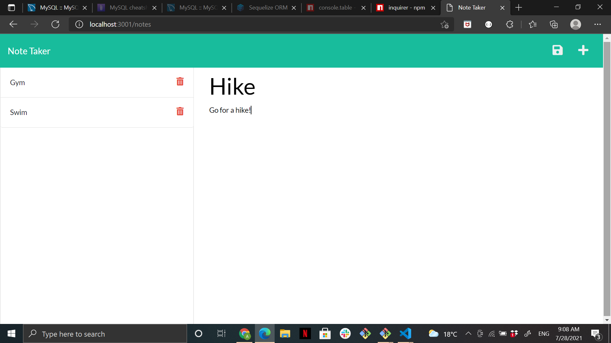
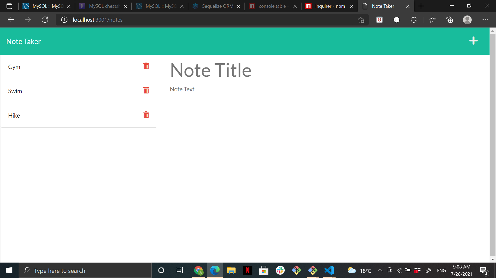
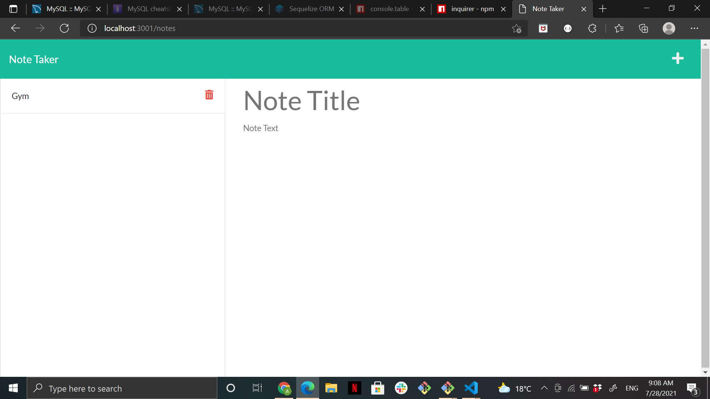

# note-takingapp

## Description
This project was fun and a bit complicated at first. However, once I was able to get the first parts working I instantly knew what to do after. My motivation was seeing it working. Therefore, this pushed me to complete the tasks.

Calling the fs functions correctly was challenging and took many trials and console.logs to get to the right structure. However, managing to have all attribute work well was very encouraging.

## Installation
Step 1: Install express and path in terminal - npm i express path

Step 2: Create a server.js file and utilize index.js file as a guide..

Step 3: Work on your GET, POST and finally DELETE functions as they will allow your Note-taking app to generate/function as requested.

Step 4: Run console logs when a code isn't functioning as expected so as to guide you.

Step 5: Use your terminal as a guide and node server.js for results.

## Usage

## License
MIT License

Copyright (c) 2021 Ann Christine Kimari

Permission is hereby granted, free of charge, to any person obtaining a copy of this software and associated documentation files (the "Software"), to deal in the Software without restriction, including without limitation the rights to use, copy, modify, merge, publish, distribute, sublicense, and/or sell copies of the Software, and to permit persons to whom the Software is furnished to do so, subject to the following conditions:

The above copyright notice and this permission notice shall be included in all copies or substantial portions of the Software.

THE SOFTWARE IS PROVIDED "AS IS", WITHOUT WARRANTY OF ANY KIND, EXPRESS OR IMPLIED, INCLUDING BUT NOT LIMITED TO THE WARRANTIES OF MERCHANTABILITY, FITNESS FOR A PARTICULAR PURPOSE AND NONINFRINGEMENT. IN NO EVENT SHALL THE AUTHORS OR COPYRIGHT HOLDERS BE LIABLE FOR ANY CLAIM, DAMAGES OR OTHER LIABILITY, WHETHER IN AN ACTION OF CONTRACT, TORT OR OTHERWISE, ARISING FROM, OUT OF OR IN CONNECTION WITH THE SOFTWARE OR THE USE OR OTHER DEALINGS IN THE SOFTWARE.